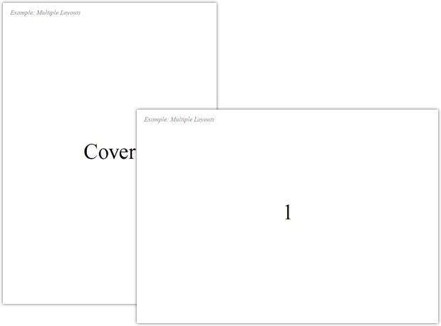

用紙サイズの異なる帳票やレイアウトの異なる帳票などを組み合わせて一つの帳票を作成する方法を解説しています。

## ゴール

## ソースコード


# coding: utf-8

require 'thinreports'

report = ThinReports::Report.create do
  use_layout 'multiple_layouts_default', :default => true
  use_layout 'multiple_layouts_cover',   :id => :cover

  # Add :cover layout (using multiple_layouts_cover.tlf).
  start_new_page :layout => :cover

  # Add 5 page using :default layout (multiple_layouts_default.tlf).
  5.times do |t|
    start_new_page do |page|
      page.item(:content).value(t + 1)
    end
  end

  # Add "multiple_layouts_back_cover.tlf" layout.
  start_new_page :layout => 'multiple_layouts_back_cover.tlf'
end

report.generate_file('multiple_layouts.pdf')


## ダウンロード

* レイアウトファイル ( [multiple_layouts_cover.tlf](files/multiple_layouts_cover.tlf) / [multiple_layouts_default.tlf](files/multiple_layouts_default.tlf) / [multiple_layouts_back_cover.tlf](files/multiple_layouts_back_cover.tlf) )
* [出力結果PDFファイル (multiple_layouts.pdf)](files/multiple_layouts.pdf)

## 使い方

1. 上記ダウンロードより「レイアウトファイル」をダウンロード
2. 同一のディレクトリに「ソースコード」の内容が記載された `multiple_layouts.rb` を作成
3. コンソール(コマンドプロンプト)から以下を実行

~~~~
$ ruby multiple_layouts.rb
~~~~
