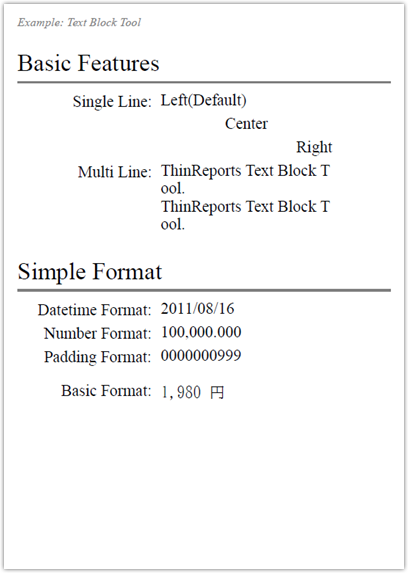

[Generator](http://www.thinreports.org/features/generator) から動的な値を挿入可能なテキストブロックツールの使い方サンプルです。基本的な使い方から、日付時刻書式や数値書式、字詰め書式などの簡易書式についても解説しています。

## ゴール

## ソースコード


# coding: utf-8

require 'thinreports'

ThinReports::Report.generate_file('textblock_tool.pdf', :layout => 'textblock_tool.tlf') do
  start_new_page

  page.values :single_line_left   => 'Left(Default)',
              :single_line_center => 'Center',
              :single_line_right  => 'Right'

  page.item(:multi_line).value("ThinReports Text Block Tool.\n" +
                               "ThinReports Text Block Tool.")

  page.values :datetime_format => Time.now,
              :number_format   => 99999.9999,
              :padding_format  => 999,
              :basic_format    => 1980
end


## ダウンロード

* [レイアウトファイル (textblock_tool.tlf)](files/textblock_tool.tlf)
* [出力結果PDFファイル (textblock_tool.pdf)](files/textblock_tool.pdf)

## 使い方

1. 上記ダウンロードより「レイアウトファイル」をダウンロード
2. 同一のディレクトリに「ソースコード」の内容が記載された `textblock_tool.rb` を作成
3. コンソール(コマンドプロンプト)から以下を実行

~~~~
$ ruby textblock_tool.rb
~~~~
