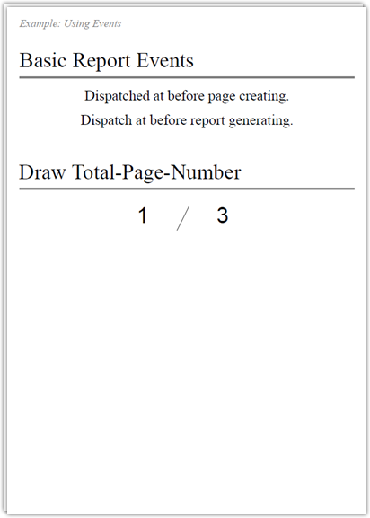

ThinReportsでは、帳票の生成ユーティリティとして「簡易イベントモデル」を提供しています。イベントを使うことにより、共通の処理を一元化したり、総ページ数の描画やさまざまな使い方が可能です。

## ゴール

## ソースコード


# coding: utf-8

require 'thinreports'

ThinReports::Report.generate_file('use_event.pdf') do
  use_layout 'use_event'

  events.on :page_create do |e|
    e.page.item(:event_page_create).value('Dispatched at before page creating.')
    # Set page-number.
    e.page.item(:page).value(e.page.no)
  end

  events.on :generate do |e|
    e.pages.each do |page|
      page.item(:event_generate).value('Dispatch at before report generating.')
      # Set total-page-number.
      page.item(:total).value(e.report.page_count)
    end
  end

  3.times { start_new_page }
end


## ダウンロード

* [レイアウトファイル (use_event.tlf)](files/use_event.tlf)
* [出力結果PDFファイル (use_event.pdf)](files/use_event.pdf)

## 使い方

1. 上記ダウンロードより「レイアウトファイル」をダウンロード
2. 同一のディレクトリに「ソースコード」の内容が記載された `use_event.rb` を作成
3. コンソール(コマンドプロンプト)から以下を実行

~~~~
$ ruby use_event.rb
~~~~
