## Hello World

最も簡単な例として、ThinReports を使って Hello World を作成してみます。

~~~~
ここで紹介するサンプルレイアウトやRubyスクリプトはダウンロードすることができます。
ダウンロード方法は、手順の最後に記載されていますので、ぜひご活用下さい。
~~~~

### Step1 帳票レイアウトの作成

#### 新規レイアウトの作成

ThinReports を起動し、ツールバーの「新規作成」ボタンから新しいレイアウトを作成します。

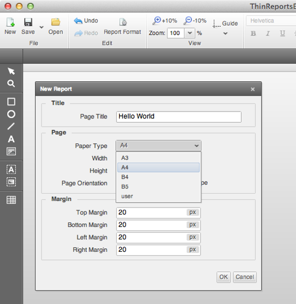

ここでは、

* タイトル「Hello World」(タイトルは無くてもOKです)
* 用紙サイズ「A4」

とします。OKをクリックすると新しいタブに真っさらなキャンバスが作成されます。ここに以下のようなレイアウトを作成する手順を説明します。

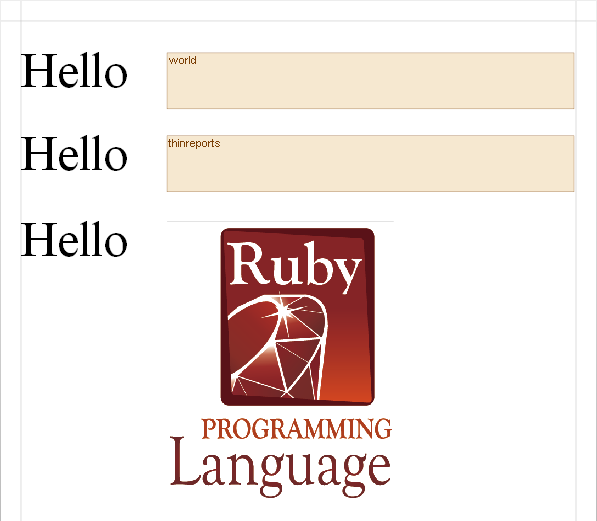

#### 静的テキストツールの使用

まず、Editor 左部にあるツールボックスより *テキストツール* を選択します。その状態で、キャンバス上の任意の場所をクリック又は範囲ドラッグすると、テキスト編集ダイアログが表示され、ここに「Hello」と入力しOKをクリックします。

~~~~
 *テキストツール*

名前の通りキャンバス上に任意の静的なテキストを描画するツールです。ツールバーの配置ボタンによって、横位置/縦位置を設定することが可能です。
~~~~

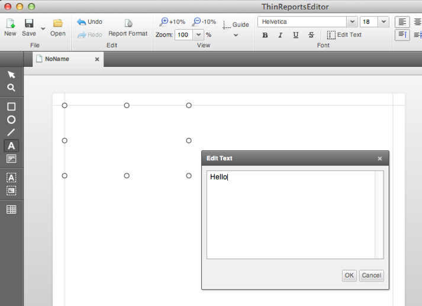

キャンバス上に「Hello」の文字が表示され、そのテキストが選択状態になっていますので、引き続きスタイルを変更します。Editor 上部にあるツールバーより、フォント「 *Times New Roman* 」を選択し、さらにその横にあるコンボボックスへ「 *50* 」と入力して下さい。

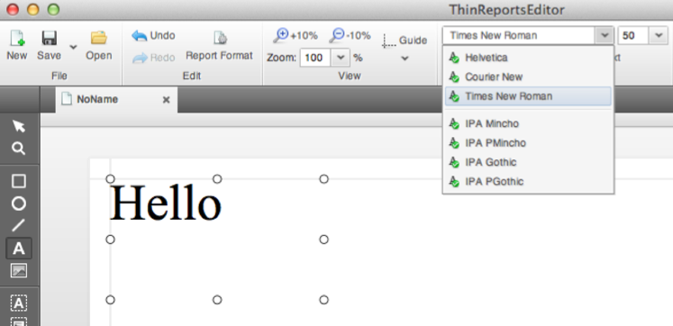

#### ブロックツールの使用

次に *ブロックツール*  を使って「World」部を作成します。

~~~~
 *ブロックツール（テキストブロックツール）*

テキストツールが *静的* であることに対して *動的* にテキストを描画するためのツールです。"Generator":http://www.thinreports.org/features/generator から、ブロックに設定された *ID* に対して任意の値がセットできるようになります。
~~~~

ブロックツールを選択し「Hello」横付近から範囲ドラッグして下さい。

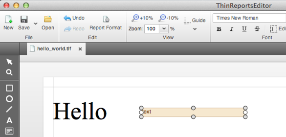

では、先ほど作成した「Hello」と同様のスタイルを設定しますが、今回は別の方法で設定してみます。
Editor 右部(プロパティペイン)では、選択されたオブジェクト(テキストやブロックなど全ての図形)のプロパティ一覧が表示され、編集することが可能です。

ブロック作成直後は、そのブロックが選択状態になっているので、ブロックのプロパティ一覧が表示されているはずです。その一覧にある「フォント」を「 *Times New Roman* 」、「サイズ」を「 *50* 」にそれぞれ設定して下さい。

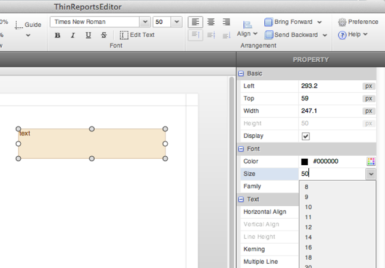

次にブロックの *ID* を設定します。デフォルトでは `text` というIDが設定されているので、これを `world` に変更します。

先ほど、スタイルを変更した場合と同様、ブロックのプロパティ一覧から設定します。プロパティ一覧の中から「ID」という項目を探し、その値を `text` から `world` に変更して下さい。すると、ブロック上の名前も `world` になります。

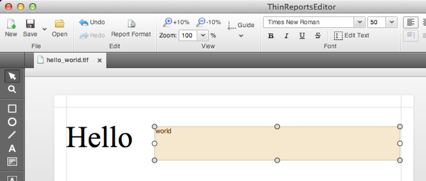

以上で「Hello」「world」の定義は完了ですが、さらに別の「Hello」「world」を追加してみます。

#### 複数選択とコピー＆ペースト

まず、ツールボックスから *選択ツール*  を選択します。そして、既に作成した「Hello」と「world」双方が含まれるように範囲ドラッグし、複数選択状態とします。なお `Ctrl(Command) + クリック` でも可能です。

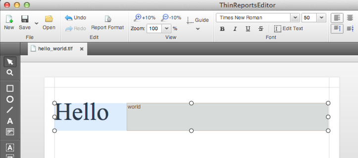

その状態で `Ctrl(Command)-C` を押下（コピー）し、そのまま `Ctrl(Command)-V` を押下（ペースト）します。そうするとコピーされた「Hello」と「world」がオリジナルと同じ位置に貼り付けられ、複数選択された状態になります（重なっているため少々分かりにくいです）

そのまま *十字キーの下キー* を何度か押下して以下のように配置します。

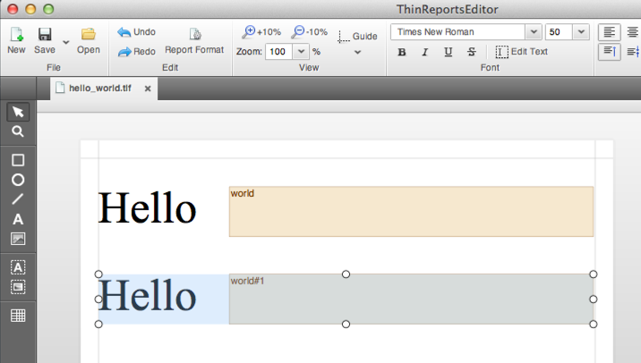

それでは、コピーしたブロックの設定を変更します。

まず、複数選択状態を解除するため、キャンバスの任意の場所をクリックします。そして、コピーしたブロックのみを再度選択し、コピーしたブロックのIDを `world#1` から `thinreports` とし、フォントを「 *IPA P明朝* 」とします。

~~~~
*フォント指定に関する注意点*

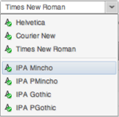

ThinReportsでは、日本語に限らず全てのテキストを正しくPDFに出力するために「 *標準フォント* 」を導入しています。標準フォントは、Editorのフォントリストに表示された7種類のフォントであり、現時点ではこれらのフォントのみ指定できます。
※標準フォントは、Editorにビルトインされており、別途インストールする必要はありません。

 Helvetica       (Sans-Serif)
 Times New Roman (Serif)
 Courier New     (Monospace)
 IPA 明朝
 IPA P明朝
 IPA ゴシック
 IPA Pゴシック

また `Helvetica` などの欧文フォントを指定したテキストやテキストブロックに日本語が含まれる場合は、自動的に `IPA 明朝` が適用されますが、可能な限りこのような状況は避けるべきです（パフォーマンスの観点から）

なお、ThinReportsによって出力されるPDFは、原則として使用されたフォントが埋め込まれます。よって、 *各クライアント側にIPAフォントなどを別途インストールする必要はありません* 。
~~~~

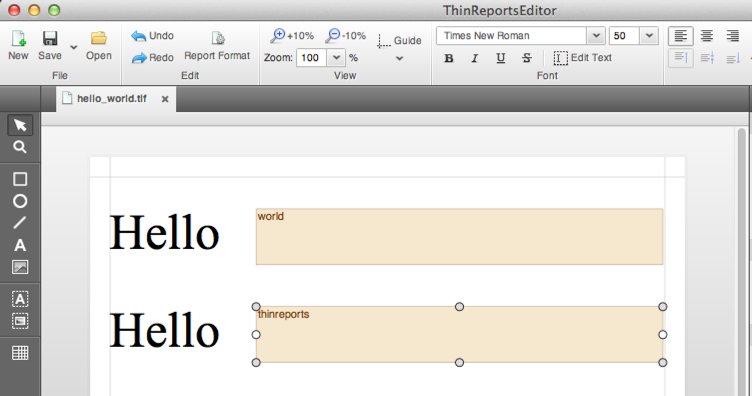

#### ブロック以外の図形へのID設定

さらに、ブロック以外の図形にも ID を設定してみます。最初に作成した「Hello」を選択し、プロパティ一覧で ID を `hello` と設定して下さい。ブロック以外の図形にIDを設定することで [Generator](http://www.thinreports.org/features/generator) から塗りや枠線の色を変更したり、表示/非表示を切り替えることができるようになります。

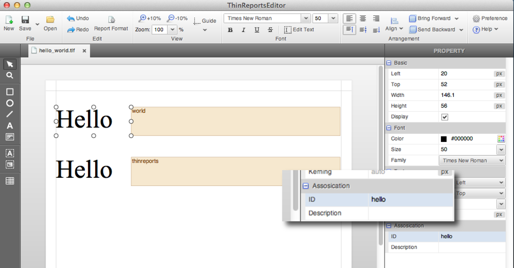

#### 画像ツールの使用

続いて、画像ツールを使って画像の埋め込みを行います。

まず、最初に作成した「Hello」をコピー＆ペーストして2段目の「Hello」下に配置します。
そして、ツールボックスより *画像ツール*  を選択し、キャンバスの任意の場所をクリックします。

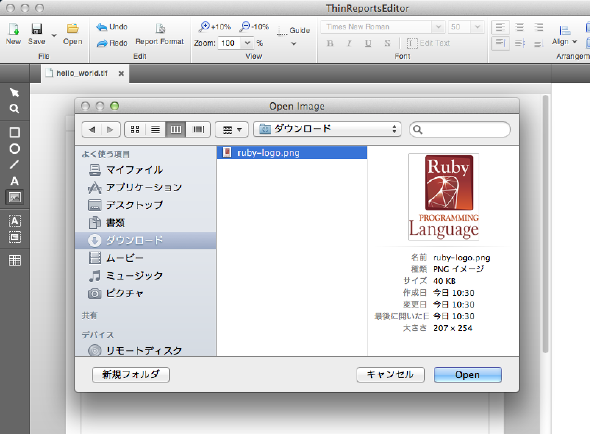

画像を選択するダイアログが表示されるので、ローカルに保存した [ruby-logo.png](files/ruby-logo.png) を選択します。
以下のように画像のサイズ及び位置を調整して完了です。

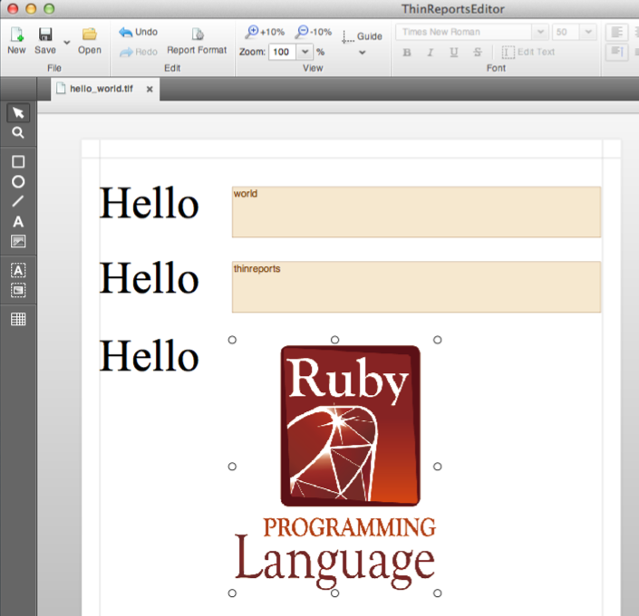

以上でレイアウトの作成は終了です。
ツールバーの保存ボタンをクリックし、任意の場所に保存して下さい（ここでは `/Users/<user>/Documents/hello_world.tlf` としています）

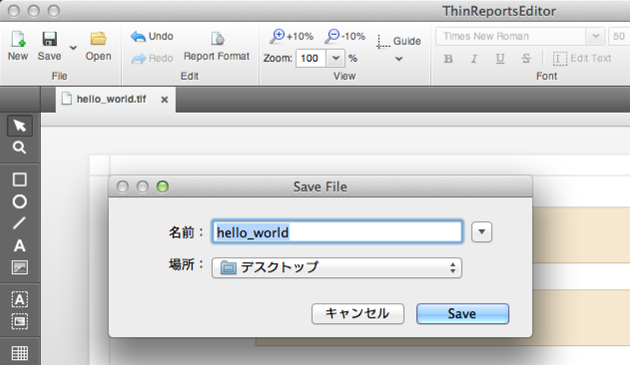

### Step2 帳票生成スクリプトの作成

次に Step1 で作成したレイアウトを読み込んで、帳票出力を行う Rubyスクリプトを作成します。以下の内容で、任意の名前・場所に保存して下さい。ここでは、レイアウトファイルと同じ場所に `/Users/<user>/Documents/hello_world.rb` として作成します。


# coding: utf-8

# (A)
require 'thinreports'

# (B)
report = ThinReports::Report.new :layout => 'hello_world'

# (C) Page 1
report.start_new_page

report.page.item(:world).value('ThinReports')
report.page.item(:thinreports).value('ThinReports')

# (D) Page 2
report.start_new_page do |page|
  page.item(:world).value('Ruby').style(:color, '#ff0000')
  page.item(:hello).style(:color, '#ff0000')
  page.item(:thinreports).value('ThinReports')
end

# (E) Page 3
report.start_new_page do
  item(:world).value('Hello')
  item(:hello).hide
end

# (F) Page 4
report.start_new_page do
  values(:world => 'World',
         :thinreports => 'ThinReports')
end

# (G)
report.generate_file('hello_world.pdf')

puts 'Done!'


では、上記スクリプトを簡単に解説します。

#### (A)

`thinreports` をロードしています。

#### (B)

読み込むレイアウトファイルを指定して `ThinReports::Report` クラスを初期化しています。レイアウトファイルを指定する際は、拡張子 `*.tlf` は省略可能です。また、これは以下のように記述することも可能です。

##### create メソッド + 引数なし


report = ThinReports::Report.create(:layout => 'hello_world.tlf') do
  start_new_page
  # :
end


##### create メソッド + 引数あり


report = ThinReports::Report.create(:layout => 'hello_world') do |r|
  r.start_new_page
  # :
end


##### generate メソッドを直接使用(ブロック引数の有無は #create と同様)

この場合は、生成されたPDF文字列が返されますので、手動でファイルを作成するか、
HTTPレスポンスの場合は、適切なMIME-Typeを指定して返却します。
なお、#generate の最初の引数の :pdf は、省略可能です。


output = ThinReports::Report.generate(:pdf, :layout => 'hello_world') do
  start_new_page
  # :
end


##### generate_file メソッドを直接使用(ブロック引数の有無は #create と同様)


ThinReports::Report.generate_file('hello_world.pdf', :layout => 'hello_world') do |report|
  report.start_new_page
end


##### use_layout メソッドを指定してレイアウトファイルを設定


report = ThinReports::Report.new
report.use_layout 'hello_world.tlf'

ThinReports::Report.generate do
  use_layout 'hello_world'
end


#### (C)

新しいページが追加され `report.page` が追加されたページを参照するようになります。

#### (D)

*(C)* と同様にページを追加していますが、引数付きのブロックを指定しています。これによって、ブロック引数 `page` が追加されたページを参照するようになります。さらに、ここでは単に値を設定するだけでなく `#style()` をメソッドチェーンでコールし文字の色を動的に設定しています( `:color` はテキストの文字色を指します )

#### (E)

ブロック付きでページを追加していますが、ブロック引数を省略しています。ブロック引数を省略すると、ブロック内のスコープが `report.page` になり、結果 `#item()` メソッドなどをレシーバ無しでコールすることが可能です。さらに `:hello` オブジェクトを #hide() メソッドにより非表示に設定しています。

#### (F)

*(E)* と同じ方法でページを追加していますが、各ブロックへの値の設定方法として `#values()` メソッドを使用しています。 `#values()` メソッドは `:id => value` の形式で複数のブロックに対して一度に値を設定することが可能です。

#### (G)

それまでに設定された内容を元に `hello_world.pdf` という名前で *PDF* ファイルを生成しています。 `#generate_file()` の代わりに `#generate` を使用することで、ファイルを生成せずにPDFデータを取得することも可能です。

### Step3 帳票生成

では、実際にPDFファイルを生成してみます。コンソールから以下のコマンドを実行して下さい。


$ cd ~/Documents
$ ruby hello_world.rb
Done!


コンソール上に `Done!` と表示されれば成功です。
スクリプトと同じ場所に `hello_world.pdf` というPDFファイルが作成されているはずです。

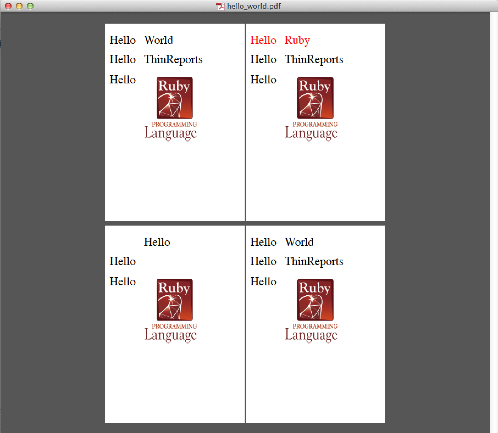

### ダウンロード

上記で使用したファイルは、以下よりダウンロードできます。ぜひ、参考にして下さい。

* [hello_world.tlf (レイアウトファイル)](files/hello_world.tlf)
* [hello_world.rb (Rubyスクリプトファイル)](files/hello_world.rb)
* [hello_world.pdf (出力結果PDFファイル)](files/hello_world.pdf)
* [hello_world.zip (上記3ファイルのアーカイブ)](files/hello_world.zip)

## 簡易仕様書の自動生成

ThinReports Editorには「簡易仕様書作成機能」があり、 `HTML/CSV` 形式で出力可能です。
上記「Hello World」レイアウトの仕様書を作成するには、以下のように「保存 - レイアウト定義をエクスポート」をクリックします。

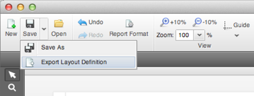

保存先とファイル種別( `HTML/CSV` )を選択するダイアログが表示されるので、任意の保存先、ファイル種別を選択して保存して下さい。なお `HTML` で出力した場合は、以下のような `HTML` ドキュメントが作成されます。

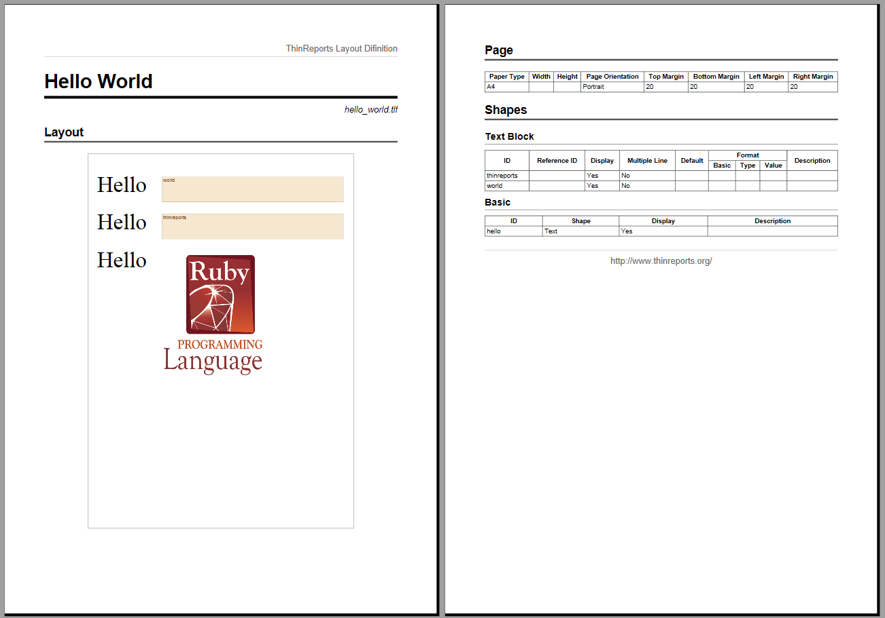

但し、Google Chrome/Safari/Firefox ではスナップショット(左部)内の画像(Rubyロゴ)が表示されません。IE9 以上では正しく表示されます。
